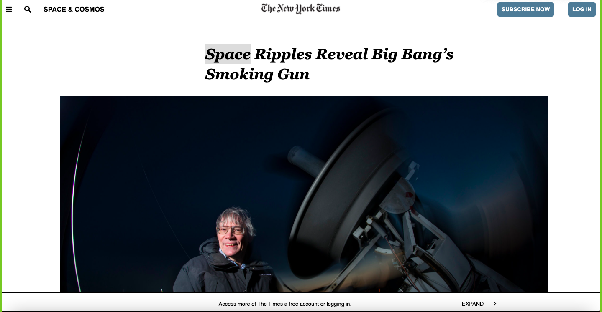

# NYTimes-Clone
Clone page of NewYork Times 

We made a clone of the NYTimes page, it has a functional video, buttons, and interactive icons. It has mock suggestions showing video name and views, and a mock section for commentaries. The focus of this branch was to make everything fit in the right places.
ScreenShot:

.

Built With
HTML
CSS
Live Demo
Live Demo Link : https://dsunilk.github.io/NYTimes-Clone/.

1- Clone the repository

2- Open the folder on VS Code, right click the index.html file and click on "Open With Live Server"

3- Everything should be running by now.

Authors
bust_in_silhouette 

GitHub: @DsunilK 
Twitter: @DsunilK
Linkedin: @DsunilK
bust_in_silhouette Angela Cuahutle

GitHub: @angelacuahutle
Twitter: @AngelaCunaDev
handshake Contributing
Contributions, issues, and feature requests are welcome!

Feel free to check the [issues page] ()

Show your support
Give a star if you like this project!

memo License
This project is MIT licensed.